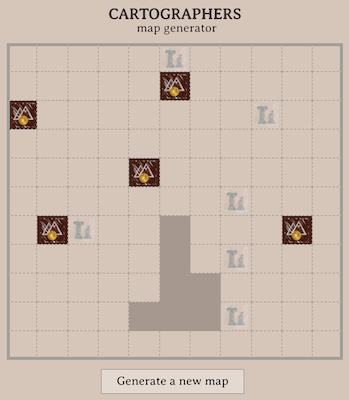

# Cartographers map generator

The Cartographers is a modern board game where your goal is to sketch the most efficient maps. More on Board Game Geek https://boardgamegeek.com/boardgame/263918/cartographers.

This project is a simple map generator that you can use as a base for your games.

You can check it here: http://zofiakorcz.pl/cartographers

It's a PWA which means it is intended to work on any platform that uses a standards-compliant browser, including both desktop and mobile devices. Users can add a shortcut to their Home screen so they can access it with a single tap.

# How to run

This project was bootstrapped with [Create React App](https://github.com/facebook/create-react-app).

In the project directory, you can run:

`yarn start`

which runs the app in the development mode.
Open [http://localhost:3000](http://localhost:3000) to view it in the browser.

# License

Cartographers map generator is licensed under the MIT license.